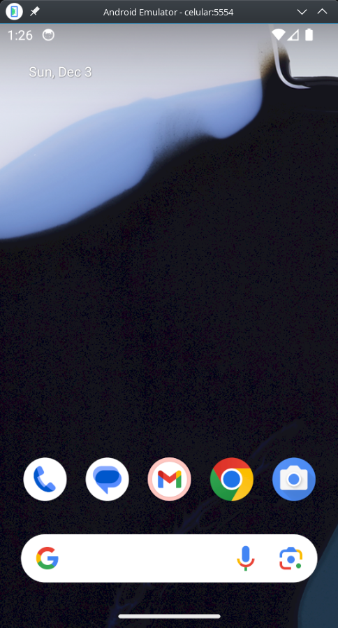

-   [1 Introdução](#introdução)
-   [2 Atualização do Ubuntu](#atualização-do-ubuntu)
-   [3 Instalando dependências](#instalando-dependências)
    -   [3.1 Dependências essenciais](#dependências-essenciais)
    -   [3.2 Kit de desenvolvimento Java](#kit-de-desenvolvimento-java)
    -   [3.3 Instalando o Android SDK](#instalando-o-android-sdk)
-   [4 Configurando o Emulador
    Android](#configurando-o-emulador-android)
    -   [4.1 Instalando o Node.js](#instalando-o-node.js)
-   [5 Instalado o React Native CLI](#instalado-o-react-native-cli)
-   [6 Primeiro aplicativo React
    Native](#primeiro-aplicativo-react-native)

# 1 Introdução

O React destaca-se como um renomado framework JavaScript, especialmente
relevante para os estudantes de especialização em programação de
aplicativos móveis. Sua proeminência reside na aplicação de paradigmas
de programação intuitivos, os quais unem o JavaScript de forma coesa a
um sistema assemelhado ao HTML denominado JSX. Esta integração
possibilita que os desenvolvedores acelerem o processo de
desenvolvimento de aplicativos.

O React Native, por sua vez, é um framework que delineia uma hierarquia
de código JavaScript composta por componentes de interface do usuário.
Ele dispõe de um conjunto específico de componentes para a construção de
aplicativos móveis com uma aparência autêntica e funcionalidade adequada
tanto para plataformas iOS quanto Android. A despeito das variações de
interface, React Native e ReactJS compartilham princípios de design
comuns, ambos concebidos pelo Facebook.

A relevância do React Native para estudantes dessa especialização é
notável pelos seguintes aspectos:

-   Possibilidade de criar interfaces de usuário para plataformas iOS e
    Android.
-   Componentes do React Native têm direitos equivalentes, permitindo a
    reutilização em aplicativos tanto para Android quanto iOS.
-   Desenvolvimento com React Native é notadamente simplificado, rápido
    e eficiente.

Este guia fornecerá instruções passo a passo, apresentando os requisitos
e procedimentos necessários para garantir uma instalação bem-sucedida.
Siga cuidadosamente as etapas delineadas abaixo para configurar seu
ambiente de programação, permitindo que você comece a desenvolver
aplicativos móveis poderosos utilizando a versatilidade e eficácia do
React Native no ambiente Linux com Ubuntu.

# 2 Atualização do Ubuntu

Para abrir o terminal do Ubuntu 21.10, pressione `Ctrl + Alt + T` no
teclado. Você também pode clicar no ícone do terminal na barra lateral
do Ubuntu.

É uma boa pratica atualizar a lista de pacotes disponíveis no sistema
antes de instalar novos pacotes. Para fazer isso, execute o seguinte
comando:

``` bash
sudo apt update -y
sudo apt upgrade -y
```

O comando `sudo apt update -y` atualiza a lista de pacotes disponíveis
no sistema de forma automatizada, sem exigir intervenção do usuário para
confirmar a atualização.

O `sudo` é usado para executar o comando com privilégios de superusuário
(root), e será possivelmente solicitado que o usuário digite a senha de
super usuário. Ele será usado vários comando usado neste tutorial com a
mesma finalidade.

O -y no final do comando indica que o usuário não será solicitado a
confirmar a instalação. Isso é útil ao automatizar a instalação de
pacotes, pois não exige que o usuário digite “y” ou “yes” para confirmar
a instalação.

Se tudo der certo será produzido a seguinte saída no terminal:

``` txt
Hit:1 http://archive.ubuntu.com/ubuntu jammy InRelease
Hit:2 http://archive.ubuntu.com/ubuntu jammy-updates InRelease
Hit:3 http://security.ubuntu.com/ubuntu jammy-security InRelease
Hit:4 http://archive.ubuntu.com/ubuntu jammy-backports InRelease
Reading package lists... Done
Building dependency tree... Done
Reading state information... Done
9 packages can be upgraded. Run 'apt list --upgradable' to see them.
```

O comando `sudo apt upgrade -y`, por sua vez, instala as versões mais
recentes dos pacotes instalados no sistema.

Para testar se o sistema está atualizado, execute o seguinte comando:

``` bash
sudo apt list --upgradable
```

Este comando deverá listar os pacotes que podem ser atualizados, se
houver algum.

# 3 Instalando dependências

Agora que o seu sistema está atualizado, você pode instalar as
dependências necessárias para o React Native.

## 3.1 Dependências essenciais

``` bash
sudo apt install -y build-essential libssl-dev libcurl4-openssl-dev /
  libexpat1-dev gettext unzip nano git libpulse-dev
```

Esse comando é usado para instalar um conjunto de pacotes essenciais e
dependências no sistema. Aqui está uma explicação do que cada parte do
comando faz:

-   `build-essential`: Este pacote inclui ferramentas fundamentais para
    compilar software no sistema, como `gcc` (Compilador GNU para C),
    `g++` (Compilador GNU para C++), e outras ferramentas e bibliotecas
    relacionadas.

-   `libssl-dev`: Fornece os desenvolvedores com as bibliotecas e
    cabeçalhos necessários para desenvolver aplicativos que utilizam a
    biblioteca OpenSSL, que é comumente usada para segurança e
    criptografia.

-   `libcurl4-openssl-dev`: Contém os arquivos de desenvolvimento para a
    biblioteca libcurl, que é utilizada para realizar operações de
    transferência de dados através de vários protocolos, como HTTP e
    FTP.

-   `libexpat1-dev`: Oferece os cabeçalhos e arquivos de desenvolvimento
    para a biblioteca Expat, que é uma biblioteca para análise de XML.

-   `gettext`: Fornece ferramentas e bibliotecas para
    internacionalização (i18n) e localização (l10n) de aplicativos,
    permitindo que eles sejam adaptados para diferentes idiomas e
    regiões.

-   `unzip`: Um utilitário para descompactar arquivos zip.

-   `nano`: Um editor de texto simples na linha de comando. É mais
    amigável para iniciantes do que alguns editores mais avançados, como
    o Vim ou o Emacs.

-   `git`: Um sistema de controle de versão distribuído amplamente
    utilizado. É utilizado para rastrear as alterações no código-fonte
    durante o desenvolvimento de software.

-   `libpulse-dev`: Fornece os cabeçalhos de desenvolvimento para a
    biblioteca PulseAudio, que é usada para lidar com áudio em sistemas
    Linux.

## 3.2 Kit de desenvolvimento Java

Apesar do site do React Native atualmente recomenda a versão 11 do Java
SE Development Kit (JDK). Essa versão se mostrou imcompatível com a
ferramenta de linha de comando do Android SDK. Por isso, recomenda-se a
instalação da versão 17 do OpenJDK.

O seguinte comando instala o OpenJDK 17 no sistema:

``` bash
sudo apt install -y openjdk-17-jdk
```

Para saber se a instalação foi bem sucedida, execute o seguinte comando:

``` bash
java -version
```

A saída do comando `java -version` é mostrada abaixo:

``` txt
openjdk version "17.0.8.1" 2023-08-24
OpenJDK Runtime Environment (build 17.0.8.1+1-Ubuntu-0ubuntu122.04)
OpenJDK 64-Bit Server VM (build 17.0.8.1+1-Ubuntu-0ubuntu122.04, mixed mode, sharing)
```

Aqui, identificamos que a versão do OpenJDK instalada é a 17. No
entanto, se uma versão diferente da desejada for exibida, pode indicar a
presença de mais de uma versão no sistema. Para confirmar isso, utilize
o seguinte comando:

``` bash
sudo update-alternatives --config java
```

A saída do comando `sudo update-alternatives --config java` é mostrada
abaixo:

``` txt
There are 2 choices for the alternative java (providing /usr/bin/java).

  Selection    Path                                         Priority   Status
------------------------------------------------------------
  0            /usr/lib/jvm/java-17-openjdk-amd64/bin/java   1711      auto mode
* 1            /usr/lib/jvm/java-11-openjdk-amd64/bin/java   1111      manual mode
  2            /usr/lib/jvm/java-17-openjdk-amd64/bin/java   1711      manual mode

Press <enter> to keep the current choice[*], or type selection number: 
```

Este comando indica que a versão atual do Java é a 11, enquanto a versão
17 também está instalada no sistema. Para escolher a versão 17, digite o
número 0 e pressione “Enter”.

## 3.3 Instalando o Android SDK

Para obter o Android SDK, o Android Studio é necessário por padrão.
Porém, o Android Studio tem 772 MB e ainda faz o download das demais
ferramentas necessárias.

Para aqueles que desejam ter apenas o Visual Studio Code como IDE de
desenvolvimento móvel, podem obter apenas as ferramentas de comando do
Android.

No endereço <https://developer.android.com/studio#command-tools>, baixe
o arquivo ZIP das ferramentas de comando do Android para o sistema
operacional Linux.

<figure>

<figcaption aria-hidden="true">Download da ferramenta de linha de
comando</figcaption>
</figure>

Desça até o final da página e encontre a seção chamada “Somente
Ferramentas de Linha de Comando”.

Procure pelo diretório onde o arquivo foi baixado, normalmente
localizado na pasta “Downloads” dentro do diretório principal do
usuário.

### 3.3.1 Estrutura de diretórios

Organize um diretório chamado DevTools no seu diretório inicial,
preferencialmente nomeado como “DevTools” ou escolha um nome apropriado:

``` bash
mkdir ~/DevTools
```

Utilize este diretório como espaço para a instalação de diversas
ferramentas de desenvolvimento, kits de desenvolvimento de software, e
outros recursos.

Dentro do DevTools, crie um subdiretório específico para o Android SDK:

``` bash
mkdir ~/DevTools/Android
```

Este será o diretório principal para o Android SDK.

Em seguida, crie um subdiretório adicional dentro de Android, nomeado
cmdline-tools:

``` bash
mkdir ~/DevTools/Android/cmdline-tools
```

Extraia o arquivo ZIP baixado em um diretório específico:
`~/DevTools/Android`

``` bash
unzip ~/Downloads/commandlinetools-linux-*.zip /
  -d ~/DevTools/Android/cmdline-tools
```

É importante observar que este comando presume que o arquivo foi baixado
no diretório ~/Downloads. Caso o nome do arquivo seja diferente, ajuste
o comando de acordo.

O próximo passo consiste em renomear o diretório cmdline-tools para
‘lasted’. Essa alteração é crucial para que o Android SDK Manager
consiga localizar o diretório e instalar novos pacotes:

``` bash
mv ~/DevTools/Android/cmdline-tools/cmdline-tools /
  ~/DevTools/Android/cmdline-tools/lasted
```

Dentro do diretório `~/DevTools/Android/`, você notará subdiretórios
adicionais relacionados ao Android SDK. Esses diretórios são criados
durante a instalação de novos pacotes, os quais serão adicionados
posteriormente.

Ao concluir este tutorial, a estrutura de diretórios deve se assemelhar
à seguinte descrição:


### 3.3.2 Variáveis de ambiente

Defina o caminho do diretório Android SDK nas variáveis ​​de ambiente do
Ubuntu. Edite o seguinte arquivo:

``` bash
nano ~/.bashrc
```

Adicione ao final do arquivo `.bashrc`:

``` bash
export ANDROID_SDK_ROOT=$HOME/DevTools/Android
export ANDROID_HOME=$ANDROID_SDK_ROOT
export PATH=$PATH:$ANDROID_HOME/emulator
export PATH=$PATH:$ANDROID_HOME/platform-tools
export PATH=$PATH:$ANDROID_HOME/cmdline-tools/lasted/bin
```

Quando você realiza modificações no seu arquivo `.bashrc`, essas
alterações não são aplicadas imediatamente ao terminal em uso. Ao
executar o comando a seguir, o Bash é instruído a reler e aplicar
novamente as configurações no terminal atual, eliminando a necessidade
de fechar e abrir um novo terminal:

``` bash
source ~/.bashrc
```

Esse comando assegura que as atualizações feitas no arquivo .bashrc
sejam imediatamente refletidas no ambiente do terminal atual.

> Se você estiver usando a shell `zsh` no lugar do `bash`, o arquivo de
> configuração é `~/.zshrc` e você pode recarregar o arquivo de
> configuração com o comando `source ~/.zshrc`.

### 3.3.3 Testando a instalação

Verificando a versão do SDK Manager:

``` bash
sdkmanager --version
```

Ao executar esse comando, a saída geralmente incluirá a versão atual do
SDK Manager instalada no seu sistema. Isso pode servir para garantir que
você esteja usando a versão mais recente ou para fins de referência ao
documentar ou depurar problemas relacionados ao ambiente de
desenvolvimento Android.

O próximo passo é aceitar as licenças do Android SDK. Para isso, execute
o seguinte comando:

``` bash
sdkmanager --licenses
```

A execução deste comando é seguida por uma série de prompts interativos
nos quais você pode revisar as licenças e, se concordar com os termos,
aceitá-las. Isso é útil em ambientes automatizados ou em scripts de
instalação, onde é necessário aceitar as licenças automaticamente para
que a instalação prossiga sem intervenção manual.

Lembre-se de que a aceitação de licenças é uma etapa importante no
processo de configuração do ambiente de desenvolvimento Android e é
necessária para garantir conformidade com os termos de uso associados
aos componentes do SDK.

Não esqueça de atualizar o SDK Manager para a versão mais recente:

``` bash
sdkmanager --update
```

Ao executar esse comando, você está garantindo que o seu ambiente de
desenvolvimento Android está atualizado com as versões mais recentes dos
componentes do SDK, o que é importante para garantir a compatibilidade
com as versões mais recentes do Android, receber correções de bugs e
obter as últimas funcionalidades.

Agora vamos instalar os pacotes necessários para o desenvolvimento de
aplicativos Android.

Cada versão do Android possui um nível de API (API Level) que é um
número inteiro que identifica a versão do Android. Por exemplo, a versão
11 do Android possui o nível de API 30. A versão 12 do Android possui o
nível de API 31 e 32. A versão 13 do Android possui o nível de API 33. E
assim por diante.

Você encontrará mais informações sobre os níveis de API em:
<https://developer.android.com/guide/topics/manifest/uses-sdk-element#ApiLevels>

Os comando abaixo instalam os pacotes necessários para o desenvolvimento
de aplicativos Android na versão 14 (nível 34). Mas você pode escolher
outra versão do Android.

``` bash
sdkmanager 'platform-tools'
sdkmanager 'emulator'
sdkmanager 'build-tools;34.0.0' 
sdkmanager 'platforms;android-34' 
sdkmanager 'system-images;android-34;google_apis;x86_64'
```

-   `sdkmanager 'platform-tools'`: Este comando instala as ferramentas
    de plataforma do Android, que incluem utilitários como `adb`
    (Android Debug Bridge) e `fastboot`. Essas ferramentas são
    essenciais para depurar e interagir com dispositivos Android durante
    o desenvolvimento.

-   `sdkmanager 'emulator'`: Este comando instala o Android Emulator,
    que é um emulador de dispositivo Android. Ele permite testar seu
    aplicativo em diferentes versões do Android e em diferentes tamanhos
    de tela sem a necessidade de um dispositivo físico.

-   `sdkmanager ‘build-tools;34.0.0’`: Este comando instala a versão
    específica 34.0.0 das ferramentas de compilação do Android. As
    ferramentas de compilação (build tools) são usadas para compilar o
    código-fonte do seu aplicativo Android em um formato que pode ser
    executado em dispositivos Android.

-   `sdkmanager ‘platforms;android-34’`: Este comando instala a
    plataforma Android 34, que é uma versão específica do Android. O
    número após o hífen representa a versão do Android. Isso é
    necessário para que você possa compilar e testar seu aplicativo em
    dispositivos que executam essa versão do sistema operacional.

-   `sdkmanager ‘system-images;android-34;google_apis;x86_64’`: Este
    comando instala uma imagem do sistema para o emulador. A imagem do
    sistema contém os arquivos necessários para emular um dispositivo
    Android com uma versão específica do Android e uma configuração
    específica (nesse caso, “google_apis;x86_64”). Isso é usado pelo
    emulador para simular um ambiente Android específico.

# 4 Configurando o Emulador Android

<!-- https://brunorozendo.com/post/criar-avd-gnu-linux.html -->

Agora vamos criar um dispositivo virtual Android (AVD) para testar
nossos aplicativos. AVD é uma configuração que permite emular
dispositivos Android em um ambiente de desenvolvimento. Desenvolvedores
usam AVDs para testar aplicativos em diferentes versões do Android,
resoluções de tela e outros aspectos, sem a necessidade de ter
dispositivos físicos para cada configuração.

O comando `avdmanager` é usado para criar e gerenciar AVDs. Ele é
instalado com o Android SDK Manager.

Então vamos criar o AVD com o comando abaixo:

``` bash
avdmanager create avd\
 -n celular\
 -k "system-images;android-34;google_apis;x86_64" \
 --device "Nexus 5"\
 --sdcard 100M
```

O comando fornecido é uma linha de comando para criar um Android Virtual
Device (AVD) usando o `avdmanager`. Vamos dividir cada parte do comando
para entender melhor:

-   `avdmanager create avd`: Inicia o processo de criação de um Android
    Virtual Device.

-   `-n celular`: Define o nome do AVD como “celular”.

-   `-k "system-images;android-34;google_apis;x86_64"`: Especifica a
    imagem do sistema que será usada para o AVD. Neste caso, está usando
    a imagem do sistema Android 34 (Android 14) com suporte a APIs do
    Google e arquitetura x86_64.

-   `--device "Nexus 5"`: Indica o dispositivo a ser emulado, neste
    caso, um Nexus 5. Podemos usar o comando `avdmanager list device`
    para listar os dispositivos disponíveis.

-   `--sdcard 100M`: Define o tamanho do cartão SD para 100 megabytes.

Certifique-se de que o SDK Android esteja configurado corretamente e que
você tenha a imagem do sistema especificada (Android 14 neste caso)
baixada e disponível no seu ambiente de desenvolvimento antes de
executar este comando. Este comando criará um AVD chamado “celular” com
as configurações fornecidas.

Para executar o AVD, execute o seguinte comando:

``` bash
emulator\
 -avd celular\
 -memory 4096\
 -accel on\
 -gpu on
```

Vamos analisar cada parte do comando:

-   `emulator`: Inicia o emulador Android.

-   `-avd celular`: Especifica o nome do AVD a ser iniciado, que neste
    caso é “celular”.

-   `-memory 4096`: Define a quantidade de memória RAM alocada para o
    emulador. Neste caso, são alocados 4096 megabytes (4 GB) de RAM.

-   `-accel on`: Ativa a aceleração de hardware para o emulador. Isso
    geralmente melhora o desempenho do emulador.

-   `-gpu on`: Ativa a emulação de GPU para o emulador. Isso permite que
    o emulador use a GPU do sistema para renderização gráfica,
    melhorando o desempenho gráfico.

Certifique-se de que o emulador esteja configurado corretamente, que o
AVD “celular” tenha sido criado com sucesso e que o sistema tenha
suporte à virtualização (se estiver usando aceleração de hardware).
Esses são fatores importantes para garantir um funcionamento adequado do
emulador Android.



## 4.1 Instalando o Node.js

O Node.js é uma plataforma de software de código aberto que permite aos
desenvolvedores criar aplicativos de rede e executar JavaScript fora do
navegador. É compatível com diversos sistemas operacionais, incluindo
Linux, macOS e Windows. O Node.js oferece um ambiente de tempo de
execução JavaScript que capacita os desenvolvedores a criar aplicativos
de rede escaláveis, além de disponibilizar um conjunto robusto de
bibliotecas JavaScript para simplificar o desenvolvimento de aplicativos
web e móveis.

Baixe e importe a chave GPG (Pretty Good Privacy) da Nodesource

``` bash
sudo mkdir -p /etc/apt/keyrings
curl -fsSL https://deb.nodesource.com/gpgkey/nodesource-repo.gpg.key |
    sudo gpg --dearmor -o /etc/apt/keyrings/nodesource.gpg
```

Este passo cria um diretório para armazenar chaves e importa a chave GPG
da Nodesource para garantir a integridade dos pacotes Node.js.

Crie um repositório DEB para o Node.js, Utilizando os seguintes comandos
para configurar o repositório DEB para o Node.js, ajustando a variável
NODE_MAJOR conforme a versão desejada:

``` bash
NODE_MAJOR=20
echo "deb [signed-by=/etc/apt/keyrings/nodesource.gpg] /
    https://deb.nodesource.com/node_$NODE_MAJOR.x nodistro main" | 
    sudo tee /etc/apt/sources.list.d/nodesource.list
```

A variável NODE_MAJOR pode ser mudada dependendo da versão do Node.js
que você deseja instalar.

| NODE_MAJOR | Observação                      |
|:----------:|---------------------------------|
|     16     | Versão atualmente não suportada |
|     18     | Versão atualmente não suportada |
|     20     | Versão LTS (Recomendada)        |
|     21     | Ultima atualização              |

Onde a versão 20 é atualmente a versão LTS (Long Term Support) do
Node.js, ou seja, a versão com suporte a longo prazo.

Execute os seguintes comandos para atualizar os pacotes e instalar o
Node.js:

``` bash
sudo apt-get update
sudo apt-get install nodejs -y
```

Para testar se o Node.js foi instalado corretamente, execute o seguinte
comando:

``` bash
node -v
```

Ao digitar `node -v` e pressionar `Enter`, você receberá a versão
específica do Node.js instalada em seu computador, permitindo uma rápida
verificação em projetos que possam ter requisitos específicos de versão.

# 5 Instalado o React Native CLI

A próxima etapa é instalar o React Native. Deve-se observar que você
precisa usar sudo para ter o React Native instalado como `root`, já que
iremos instalá-lo globalmente. Este é o código que você deve usar:

``` bash
sudo npm install -g react-native-cli
```

Após a instalação, você pode verificar se o React Native foi instalado
corretamente, executando o seguinte comando:

``` bash
react-native --version
```

# 6 Primeiro aplicativo React Native

npm install -g expo-cli

npx create-expo-app myreact

<https://www.educative.io/answers/how-to-create-a-new-react-native-project>
