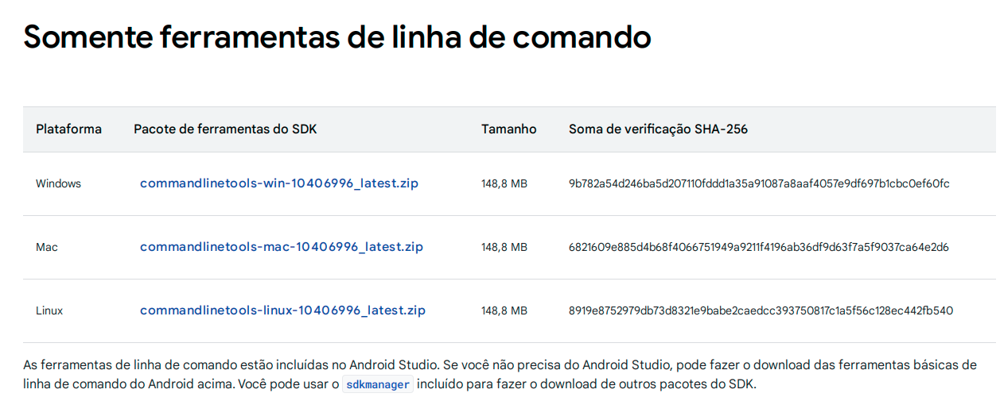
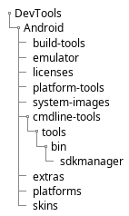

-   [1 Introdução](#introdução)
-   [2 Atualização do Ubuntu](#atualização-do-ubuntu)
    -   [2.1 Atualize a lista de pacotes disponíveis no
        sistema](#atualize-a-lista-de-pacotes-disponíveis-no-sistema)
    -   [2.2 Atualize os pacotes instalados no
        sistema](#atualize-os-pacotes-instalados-no-sistema)
-   [3 Instalando dependências](#instalando-dependências)
    -   [3.1 Dependências essenciais](#dependências-essenciais)
    -   [3.2 Kit de desenvolvimento Java](#kit-de-desenvolvimento-java)
    -   [3.3 Instalando o Android SDK](#instalando-o-android-sdk)
-   [4 Configurando o Emulador
    Android](#configurando-o-emulador-android)
    -   [4.1 Instalando o Node.js](#instalando-o-node.js)
-   [5 Instalado o React Native CLI](#instalado-o-react-native-cli)
-   [6 Primeiro aplicativo React
    Native](#primeiro-aplicativo-react-native)

# 1 Introdução

O React destaca-se como um renomado framework JavaScript, especialmente
relevante para os estudantes de especialização em programação de
aplicativos móveis. Sua proeminência reside na aplicação de paradigmas
de programação intuitivos, os quais unem o JavaScript de forma coesa a
um sistema assemelhado ao HTML denominado JSX. Esta integração
possibilita que os desenvolvedores acelerem o processo de
desenvolvimento de aplicativos.

O React Native, por sua vez, é um framework que delineia uma hierarquia
de código JavaScript composta por componentes de interface do usuário.
Ele dispõe de um conjunto específico de componentes para a construção de
aplicativos móveis com uma aparência autêntica e funcionalidade adequada
tanto para plataformas iOS quanto Android. A despeito das variações de
interface, React Native e ReactJS compartilham princípios de design
comuns, ambos concebidos pelo Facebook.

A relevância do React Native para estudantes dessa especialização é
notável pelos seguintes aspectos:

-   Possibilidade de criar interfaces de usuário para plataformas iOS e
    Android.
-   Componentes do React Native têm direitos equivalentes, permitindo a
    reutilização em aplicativos tanto para Android quanto iOS.
-   Desenvolvimento com React Native é notadamente simplificado, rápido
    e eficiente.

Este guia fornecerá instruções passo a passo, apresentando os requisitos
e procedimentos necessários para garantir uma instalação bem-sucedida.
Siga cuidadosamente as etapas delineadas abaixo para configurar seu
ambiente de programação, permitindo que você comece a desenvolver
aplicativos móveis poderosos utilizando a versatilidade e eficácia do
React Native no ambiente Linux com Ubuntu.

# 2 Atualização do Ubuntu

Para abrir o terminal do Ubuntu 21.10, pressione `Ctrl + Alt + T` no
teclado. Você também pode clicar no ícone do terminal na barra lateral
do Ubuntu.

O primeiro passo é atualizar o sistema operacional Ubuntu. Para fazer
isso, abra o terminal e execute o seguinte passos:

## 2.1 Atualize a lista de pacotes disponíveis no sistema

``` bash
sudo apt update -y
```

O comando `sudo apt update -y` atualiza a lista de pacotes disponíveis
no sistema de forma automatizada, sem exigir intervenção do usuário para
confirmar a atualização. Isso é frequentemente usado antes de instalar
novos pacotes ou realizar atualizações no sistema para garantir que você
esteja usando as versões mais recentes disponíveis.

O `sudo` é usado para executar o comando com privilégios de superusuário
(root), e será possivelmente solicitado que o usuário digite a senha de
super usuário. Ele será usado vários comando usado neste tutorial com a
mesma finalidade.

O -y no final do comando indica que o usuário não será solicitado a
confirmar a instalação. Isso é útil ao automatizar a instalação de
pacotes, pois não exige que o usuário digite “y” ou “yes” para confirmar
a instalação.

Se tudo der certo será produzido a seguinte saída no terminal:

``` txt
Hit:1 http://archive.ubuntu.com/ubuntu jammy InRelease
Hit:2 http://archive.ubuntu.com/ubuntu jammy-updates InRelease
Hit:3 http://security.ubuntu.com/ubuntu jammy-security InRelease
Hit:4 http://archive.ubuntu.com/ubuntu jammy-backports InRelease
Reading package lists... Done
Building dependency tree... Done
Reading state information... Done
9 packages can be upgraded. Run 'apt list --upgradable' to see them.
```

## 2.2 Atualize os pacotes instalados no sistema

``` bash
sudo apt upgrade -y
```

O comando `sudo apt upgrade -y`, por sua vez, instala as versões mais
recentes dos pacotes instalados no sistema.

Para testar se o sistema está atualizado, execute o seguinte comando:

``` bash
sudo apt list --upgradable
```

Este comando deverá listar os pacotes que podem ser atualizados, se
houver algum.

# 3 Instalando dependências

Agora que o seu sistema está atualizado, você pode instalar as
dependências necessárias para o React Native.

## 3.1 Dependências essenciais

``` bash
sudo apt install -y build-essential libssl-dev libcurl4-openssl-dev libexpat1-dev gettext unzip nano git libpulse-dev
```

Esse comando é usado para instalar um conjunto de pacotes essenciais e
dependências no sistema. Aqui está uma explicação do que cada parte do
comando faz:

-   `build-essential`: Este pacote inclui ferramentas fundamentais para
    compilar software no sistema, como `gcc` (Compilador GNU para C),
    `g++` (Compilador GNU para C++), e outras ferramentas e bibliotecas
    relacionadas.

-   `libssl-dev`: Fornece os desenvolvedores com as bibliotecas e
    cabeçalhos necessários para desenvolver aplicativos que utilizam a
    biblioteca OpenSSL, que é comumente usada para segurança e
    criptografia.

-   `libcurl4-openssl-dev`: Contém os arquivos de desenvolvimento para a
    biblioteca libcurl, que é utilizada para realizar operações de
    transferência de dados através de vários protocolos, como HTTP e
    FTP.

-   `libexpat1-dev`: Oferece os cabeçalhos e arquivos de desenvolvimento
    para a biblioteca Expat, que é uma biblioteca para análise de XML.

-   `gettext`: Fornece ferramentas e bibliotecas para
    internacionalização (i18n) e localização (l10n) de aplicativos,
    permitindo que eles sejam adaptados para diferentes idiomas e
    regiões.

-   `unzip`: Um utilitário para descompactar arquivos zip.

-   `nano`: Um editor de texto simples na linha de comando. É mais
    amigável para iniciantes do que alguns editores mais avançados, como
    o Vim ou o Emacs.

-   `git`: Um sistema de controle de versão distribuído amplamente
    utilizado. É utilizado para rastrear as alterações no código-fonte
    durante o desenvolvimento de software.

-   `libpulse-dev`: Fornece os cabeçalhos de desenvolvimento para a
    biblioteca PulseAudio, que é usada para lidar com áudio em sistemas
    Linux.

## 3.2 Kit de desenvolvimento Java

Apesar do site do React Native atualmente recomenda a versão 11 do Java
SE Development Kit (JDK). Essa versão se mostrou imcompatível com a
ferramenta de linha de comando do Android SDK. Por isso, recomenda-se a
instalação da versão 17 do OpenJDK.

O seguinte comando instala o OpenJDK 17 no sistema:

``` bash
sudo apt install -y openjdk-17-jdk
```

Para saber se a instalação foi bem sucedida, execute o seguinte comando:

``` bash
java -version
```

A saída do comando `java -version` é mostrada abaixo:

``` txt
openjdk version "17.0.8.1" 2023-08-24
OpenJDK Runtime Environment (build 17.0.8.1+1-Ubuntu-0ubuntu122.04)
OpenJDK 64-Bit Server VM (build 17.0.8.1+1-Ubuntu-0ubuntu122.04, mixed mode, sharing)
```

Aqui, identificamos que a versão do OpenJDK instalada é a 17. No
entanto, se uma versão diferente da desejada for exibida, pode indicar a
presença de mais de uma versão no sistema. Para confirmar isso, utilize
o seguinte comando:

``` bash
sudo update-alternatives --config java
```

A saída do comando `sudo update-alternatives --config java` é mostrada
abaixo:

``` txt
There are 2 choices for the alternative java (providing /usr/bin/java).

  Selection    Path                                         Priority   Status
------------------------------------------------------------
  0            /usr/lib/jvm/java-17-openjdk-amd64/bin/java   1711      auto mode
* 1            /usr/lib/jvm/java-11-openjdk-amd64/bin/java   1111      manual mode
  2            /usr/lib/jvm/java-17-openjdk-amd64/bin/java   1711      manual mode

Press <enter> to keep the current choice[*], or type selection number: 
```

Este comando indica que a versão atual do Java é a 11, enquanto a versão
17 também está instalada no sistema. Para escolher a versão 17, digite o
número 0 e pressione “Enter”.

<!--
## Android Studio

O Android Studio é um ambiente de desenvolvimento integrado (IDE) para desenvolvimento de aplicativos Android. Ele fornece uma interface gráfica do usuário (GUI) para criar e gerenciar projetos, bem como ferramentas de desenvolvimento para compilar, depurar e testar aplicativos. O Android Studio é baseado no IntelliJ IDEA, um IDE de código aberto para desenvolvimento de software.

1. Crie um diretório Development Tools em seu diretório inicial, chamado DevTools (ou use um nome apropriado):

```bash
mkdir ~/DevTools
```

> Use esse diretório para instalar quaisquer outras ferramentas de desenvolvimento, kits de desenvolvimento de software e outros.

### Crie um subdiretório no DevTools chamado Android:

```bash
mkdir ~/DevTools/Android
```

// Work in progress

https://www.linuxfordevices.com/tutorials/linux/installing-android-studio-on-linux

wget -c https://redirector.gvt1.com/edgedl/android/studio/ide-zips/2022.3.1.21/android-studio-2022.3.1.21-linux.tar.gz

cd ~/DevTools/Android

tar -xvzf ~/Downloads/android-studio-2022.3.1.21-linux.tar.gz

cd android-studio/bin

./studio.sh
-->

## 3.3 Instalando o Android SDK

Para obter o Android SDK, o Android Studio é necessário por padrão.
Porém, o Android Studio tem 772 MB e ainda faz o download das demais
ferramentas necessárias.

Para aqueles que desejam ter apenas o Visual Studio Code como IDE de
desenvolvimento móvel, podem obter apenas as ferramentas de comando do
Android.

1.  Baixe as ferramentas de comando do Android

No endereço <https://developer.android.com/studio#command-tools>, baixe
o arquivo ZIP das ferramentas de comando do Android para o sistema
operacional Linux.

<figure>

<figcaption aria-hidden="true">Download da ferramenta de linha de
comando</figcaption>
</figure>

Desça até o final da página e encontre a seção chamada “Somente
Ferramentas de Linha de Comando”.

Procure pelo diretório onde o arquivo foi baixado, normalmente
localizado na pasta “Downloads” dentro do diretório principal do
usuário.

### 3.3.1 Estrutura de diretórios

1.  Crie um diretório Development Tools em seu diretório inicial,
    chamado DevTools (ou use um nome apropriado):

``` bash
mkdir ~/DevTools
```

Use esse diretório para instalar quaisquer outras ferramentas de
desenvolvimento, kits de desenvolvimento de software e outros.

1.  Crie um subdiretório no DevTools chamado Android:

``` bash
mkdir ~/DevTools/Android
```

Esse erá o diretório raiz do Android SDK.

1.  Crie outro subdiretório, no Android, chamado cmdline-tools

``` bash
mkdir ~/DevTools/Android/cmdline-tools
```

1.  Extraia o arquivo “commandlinetools-linux-\*\*\*.zip” em um
    diretório específico: `~/DevTools/Android`

``` bash
unzip ~/Downloads/commandlinetools-linux-*.zip -d ~/DevTools/Android/cmdline-tools
mv ~/DevTools/Android/cmdline-tools/cmdline-tools ~/DevTools/Android/cmdline-tools/tools
```

No diretório `~/DevTools/Android/cmdline-tools/`, você encontrará outros
subdiretórios relacionados ao Android SDK. O diretório `cmdline-tools` é
apenas uma ferramenta dentro do SDK do Android. Outras ferramentas, como
`emulator`, `platform-tools`, `platforms`, e `licenses`, também serão
instaladas posteriormente e estarão localizadas paralelamente a essa
ferramenta.

Dessa forma ao final deste tutorial teremos a seguinte estrutura de
diretórios:



### 3.3.2 Variáveis de ambiente

1.  Defina o caminho do diretório Android SDK nas variáveis ​​de ambiente
    do Ubuntu. Edite o seguinte arquivo:

``` bash
nano ~/.bashrc
```

1.  Adicione ao final do arquivo `.bashrc`:

``` bash
export ANDROID_SDK_ROOT=$HOME/DevTools/Android
export PATH=$PATH:$ANDROID_SDK_ROOT/emulator
export PATH=$PATH:$ANDROID_HOME/platform-tools
export PATH=$PATH:$ANDROID_SDK_ROOT/cmdline-tools/tools/bin
```

1.  Recarregue o profile do Linux

``` bash
source ~/.bashrc
```

Quando você faz alterações no seu arquivo `.bashrc`, como adicionar
novas variáveis de ambiente ou definir alias, essas mudanças não têm
efeito imediato no terminal atual. Executar o comando este comando força
o Bash a ler novamente e aplicar as configurações no terminal atual, sem
precisar fechar e abrir um novo terminal.

### 3.3.3 Testando a instalação

1.  Verificando a versão do SDK Manager servirservir

``` bash
sdkmanager --version
```

Ao executar esse comando, a saída geralmente incluirá a versão atual do
SDK Manager instalada no seu sistema. Isso pode servir para garantir que
você esteja usando a versão mais recente ou para fins de referência ao
documentar ou depurar problemas relacionados ao ambiente de
desenvolvimento Android.

1.  Listando todos os pacotes disponíveis para instalação

``` bash
sdkmanager --list
```

O comando irá listar todos os pacotes SDK do Android disponíveis para
instalação. A lista incluirá o nome de cada pacote, sua versão, seu
tamanho e uma breve descrição.

1.  Aceitando as licenças

``` bash
sdkmanager --licenses
```

A execução deste comando é seguida por uma série de prompts interativos
nos quais você pode revisar as licenças e, se concordar com os termos,
aceitá-las. Isso é útil em ambientes automatizados ou em scripts de
instalação, onde é necessário aceitar as licenças automaticamente para
que a instalação prossiga sem intervenção manual.

Lembre-se de que a aceitação de licenças é uma etapa importante no
processo de configuração do ambiente de desenvolvimento Android e é
necessária para garantir conformidade com os termos de uso associados
aos componentes do SDK.

1.  Atualizando os pacotes Android quando necessário

``` bash
sdkmanager --update
```

Ao executar esse comando, você está garantindo que o seu ambiente de
desenvolvimento Android está atualizado com as versões mais recentes dos
componentes do SDK, o que é importante para garantir a compatibilidade
com as versões mais recentes do Android, receber correções de bugs e
obter as últimas funcionalidades.

1.  Instalação dos pacotes necessários:

Os comando abaixo instalam os pacotes necessários para o desenvolvimento
de aplicativos Android na versão 34.

``` bash
sdkmanager 'platform-tools'
sdkmanager 'emulator'
sdkmanager 'build-tools;34.0.0' 
sdkmanager 'platforms;android-34' 
sdkmanager 'system-images;android-34;google_apis;x86_64'
```

-   `sdkmanager 'platform-tools'`: Este comando instala as ferramentas
    de plataforma do Android, que incluem utilitários como `adb`
    (Android Debug Bridge) e `fastboot`. Essas ferramentas são
    essenciais para depurar e interagir com dispositivos Android durante
    o desenvolvimento.

-   `sdkmanager 'emulator'`: Este comando instala o Android Emulator,
    que é um emulador de dispositivo Android. Ele permite testar seu
    aplicativo em diferentes versões do Android e em diferentes tamanhos
    de tela sem a necessidade de um dispositivo físico.

-   `sdkmanager ‘build-tools;34.0.0’`: Este comando instala a versão
    específica 34.0.0 das ferramentas de compilação do Android. As
    ferramentas de compilação (build tools) são usadas para compilar o
    código-fonte do seu aplicativo Android em um formato que pode ser
    executado em dispositivos Android.

-   `sdkmanager ‘platforms;android-34’`: Este comando instala a
    plataforma Android 34, que é uma versão específica do Android. O
    número após o hífen representa a versão do Android. Isso é
    necessário para que você possa compilar e testar seu aplicativo em
    dispositivos que executam essa versão do sistema operacional.

-   `sdkmanager ‘system-images;android-34;google_apis;x86_64’`: Este
    comando instala uma imagem do sistema para o emulador. A imagem do
    sistema contém os arquivos necessários para emular um dispositivo
    Android com uma versão específica do Android e uma configuração
    específica (nesse caso, “google_apis;x86_64”). Isso é usado pelo
    emulador para simular um ambiente Android específico.

# 4 Configurando o Emulador Android

<!-- https://brunorozendo.com/post/criar-avd-gnu-linux.html -->

``` bash
avdmanager create avd\
 -n celular\
 -k "system-images;android-34;google_apis;x86_64" \
 --device "Nexus 5"\
 --sdcard 100M
```

``` bash
avdmanager list device
```

``` bash
wget -c https://github.com/dispositivos-moveis-ivaneyvieira/tutorialSetupReact/blob/master/files/skins.tar.gz
```

``` bash
emulator\
 -avd celular\
 -skindir "$ANDROID_HOME/skins" \
 -skin "nexus_5" \
 -memory 4096\
 -accel on\
 -gpu on
```

## 4.1 Instalando o Node.js

O Node.js é uma plataforma de software de código aberto que permite que
os desenvolvedores criem aplicativos de rede e executem JavaScript fora
do navegador. Ele é executado em vários sistemas operacionais, incluindo
Linux, macOS e Windows. O Node.js fornece um ambiente de tempo de
execução JavaScript que permite aos desenvolvedores criar aplicativos de
rede escaláveis. Ele também fornece um rico conjunto de bibliotecas de
JavaScript que simplificam o desenvolvimento de aplicativos da web e
móveis.

### 4.1.1 Baixe e importe a chave GPG (Pretty Good Privacy) da Nodesource

``` bash
sudo mkdir -p /etc/apt/keyrings
curl -fsSL https://deb.nodesource.com/gpgkey/nodesource-repo.gpg.key | sudo gpg --dearmor -o /etc/apt/keyrings/nodesource.gpg
```

### 4.1.2 Crie um repositório DEB para o Node.js:

``` bash
NODE_MAJOR=20
echo "deb [signed-by=/etc/apt/keyrings/nodesource.gpg] https://deb.nodesource.com/node_$NODE_MAJOR.x nodistro main" | sudo tee /etc/apt/sources.list.d/nodesource.list
```

A variável NODE_MAJOR pode ser mudada dependendo da versão do Node.js
que você deseja instalar.

| NODE_MAJOR | Observação                      |
|:----------:|---------------------------------|
|     16     | Versão atualmente não suportada |
|     18     | Versão atualmente não suportada |
|     20     | Versão LTS (Recomendada)        |
|     21     | Ultima atualização              |

Onde a versão 20 é atualmente a versão LTS (Long Term Support) do
Node.js, ou seja, a versão com suporte a longo prazo.

### 4.1.3 Execute Atualização e Instalação

``` bash
sudo apt-get update
sudo apt-get install nodejs -y
```

### 4.1.4 Para testar se o Node.js foi instalado corretamente, execute o seguinte comando:

``` bash
node -v
```

Ao digitar node -v e pressionar “Enter” no terminal ou prompt de
comando, você receberá como saída a versão específica do Node.js que
está instalada no seu computador. Isso serve para verificar rapidamente
qual versão do Node.js está em uso, especialmente ao lidar com projetos
que podem ter requisitos específicos de versão.

# 5 Instalado o React Native CLI

A próxima etapa é instalar o React Native. Deve-se observar que você
precisa usar sudo para ter o React Native instalado como `root`, já que
iremos instalá-lo globalmente. Este é o código que você deve usar:

``` bash
sudo npm install -g react-native-cli
```

Após a instalação, você pode verificar se o React Native foi instalado
corretamente, executando o seguinte comando:

``` bash
react-native --version
```

# 6 Primeiro aplicativo React Native
